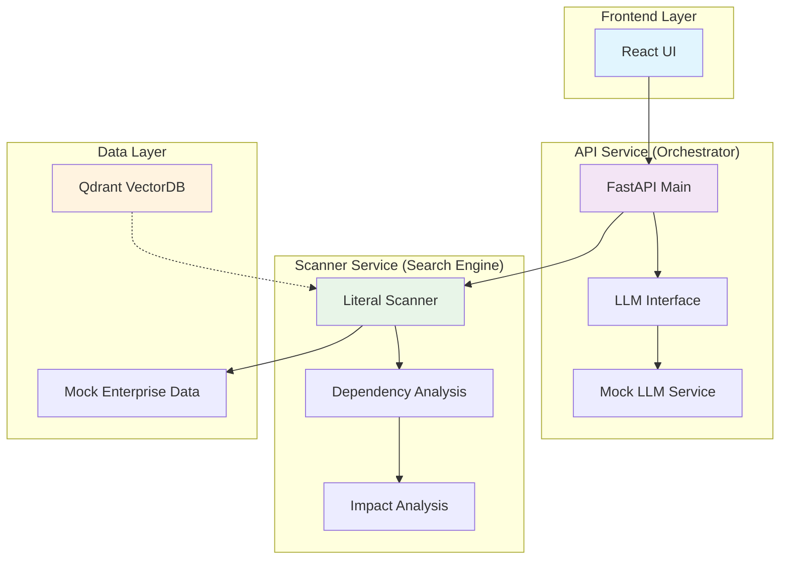
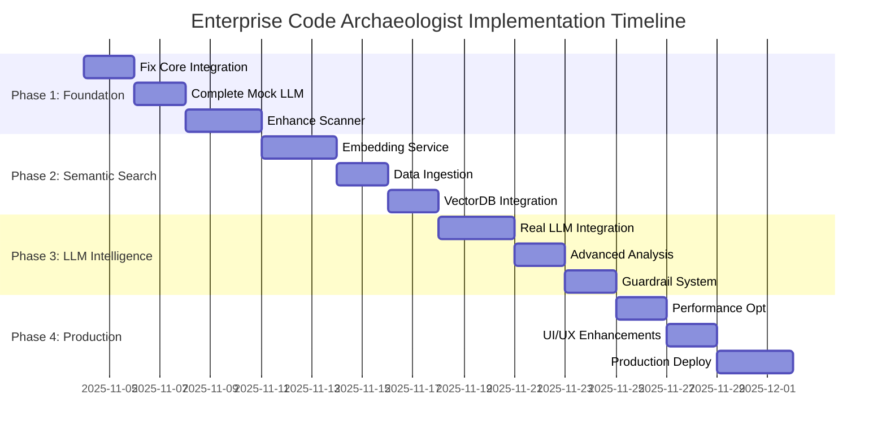
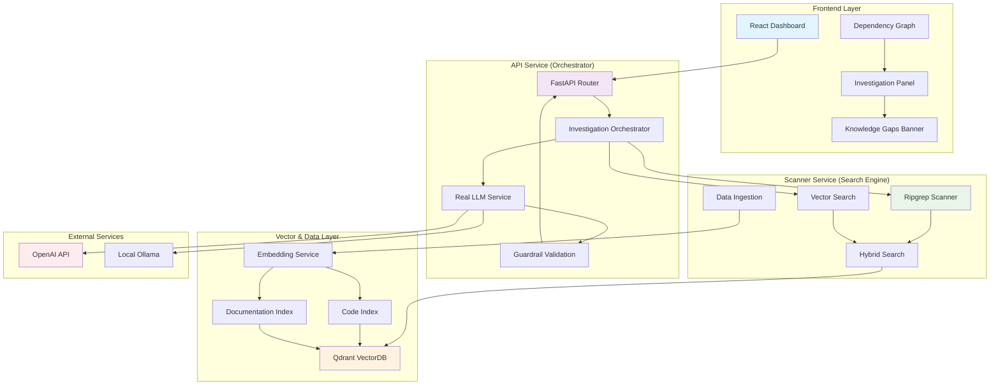
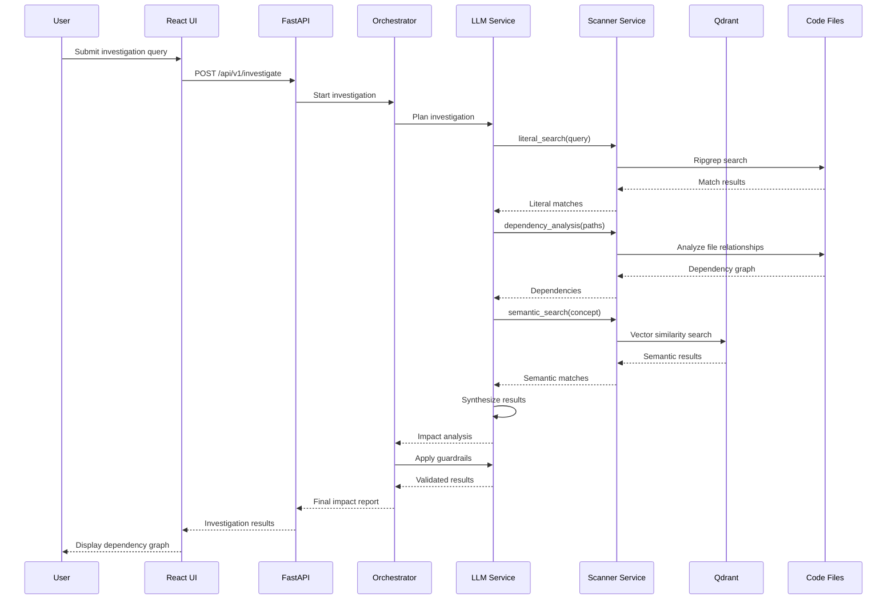
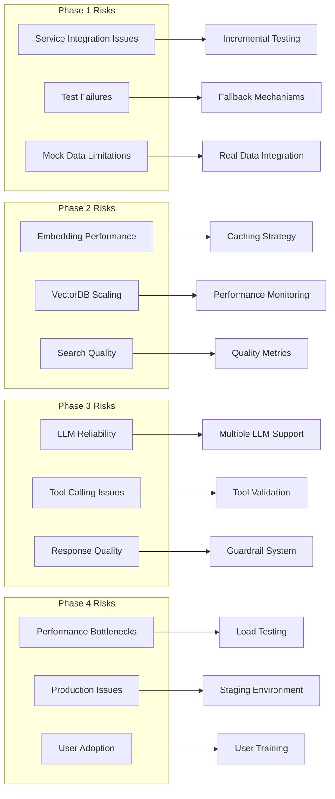
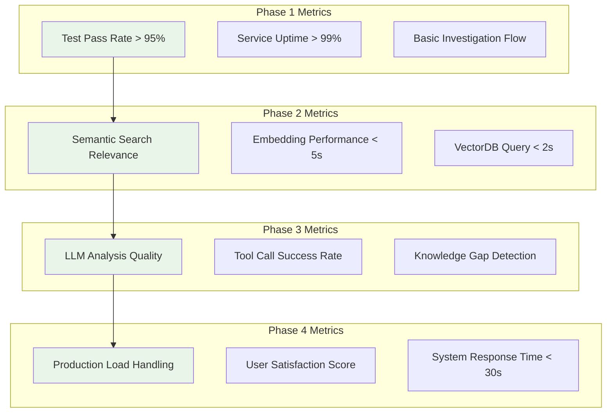

# Enterprise Code Archaeologist - Implementation Diagrams

## Current Architecture Overview

## Implementation Phase Flow

## Target Architecture (End State)

## Data Flow for Investigation

## Component Integration Matrix

| Component | Phase 1 | Phase 2 | Phase 3 | Phase 4 | Priority |
|-----------|-----------|-----------|-----------|-----------|----------|
| React UI | ✅ Basic | ✅ Enhanced | ✅ Interactive | ✅ Polished | High |
| FastAPI | ✅ Mock | ✅ Enhanced | ✅ Intelligent | ✅ Production | Critical |
| Mock LLM | ✅ Complete | ❌ Replaced | ❌ Replaced | ❌ Replaced | Medium |
| Real LLM | ❌ Not Started | ❌ Not Started | ✅ Integrated | ✅ Optimized | Critical |
| Scanner | ✅ Basic | ✅ Enhanced | ✅ Advanced | ✅ Optimized | High |
| VectorDB | ⚠️ Partial | ✅ Working | ✅ Enhanced | ✅ Optimized | High |
| Embedding | ❌ Missing | ✅ Implemented | ✅ Optimized | ✅ Production | Critical |
| Guardrails | ❌ Missing | ❌ Not Started | ✅ Implemented | ✅ Enhanced | Medium |

## Risk & Mitigation Timeline

## Success Metrics Dashboard

This visual representation provides multiple views of the implementation plan, including timeline, architecture, data flow, integration matrix, and risk mitigation strategies.