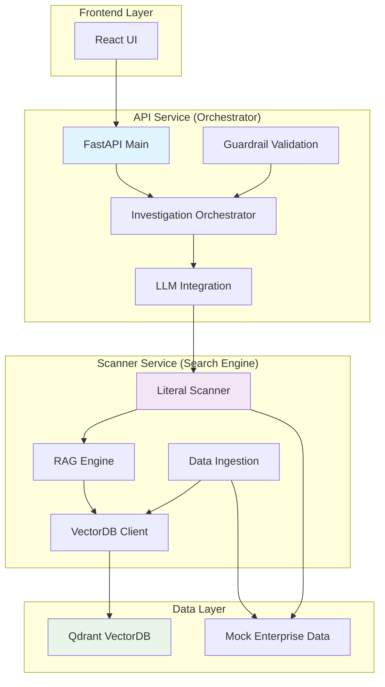
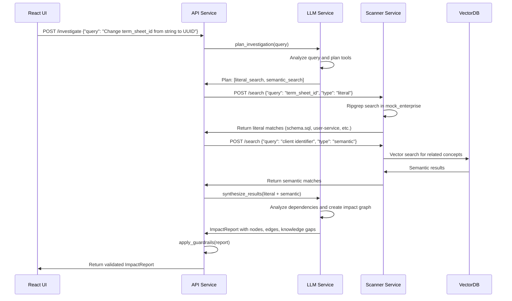

# Enterprise Code Archaeologist - Implementation Plan

## Executive Summary

This document provides a detailed implementation plan for the Enterprise Code Archaeologist system, addressing the three core components: deterministic search, LLM integration, and VectorDB ownership. The plan is designed with future multi-tenancy in mind while focusing on immediate implementation needs.

## Current State Assessment

### Strengths
- ✅ Containerized microservices architecture (API, Scanner, VectorDB)
- ✅ Comprehensive mock enterprise data supporting test cases
- ✅ Test-driven development with clear user stories
- ✅ Observability built-in with OpenTelemetry
- ✅ Basic scanner implementation using ripgrep

### Gaps to Address
- ❌ No LLM integration yet
- ❌ VectorDB exists but not integrated with search
- ❌ No data ingestion pipeline for VectorDB
- ❌ Tests are failing (as expected in Phase 1)

## Architecture Decision: VectorDB Ownership

After careful consideration, I recommend **Option A: Move VectorDB to Scanner Service**

### Rationale
1. **Single Source of Truth**: Scanner becomes the definitive search service
2. **Performance**: Co-locating literal and semantic search reduces latency
3. **Separation of Concerns**: API orchestrates, Scanner searches
4. **Future Multi-Tenancy**: Easier to implement tenant isolation in one place
5. **Scalability**: Scanner can scale independently based on search load

### Alternative: Option B - Keep VectorDB in API
- Pro: Simpler for current implementation
- Con: API becomes bloated with search logic
- Con: Tighter coupling between orchestration and data access

## Detailed Architecture



## Implementation Phases

### Phase 1: Enhanced Scanner Service (Week 1)

#### 1.1 Move VectorDB Components to Scanner
- Move [`vector_db.py`](api/app/tools/vector_db.py) and related files to scanner
- Update scanner Dockerfile to include VectorDB dependencies
- Add VectorDB environment variables to scanner service

#### 1.2 Implement Data Ingestion Pipeline
```python
# New scanner/app/ingestion.py
class DataIngestion:
    async def ingest_repository(self, repo_path: str)
    async def ingest_file(self, file_path: str)
    async def batch_ingest(self, paths: List[str])
```

#### 1.3 Enhanced Scanner API
```python
# New endpoints in scanner
POST /scanner/search/literal
POST /scanner/search/semantic
POST /scanner/search/hybrid
POST /scanner/ingest
```

### Phase 2: LLM Integration (Week 2)

#### 2.1 Define LLM Tools
```python
# Tools available to LLM
tools = [
    {
        "name": "literal_search",
        "description": "Search for exact string matches in code",
        "parameters": {
            "query": "string to search for",
            "paths": "list of paths to search"
        }
    },
    {
        "name": "semantic_search", 
        "description": "Find semantically related code",
        "parameters": {
            "query": "concept to search for",
            "limit": "max results"
        }
    },
    {
        "name": "analyze_dependencies",
        "description": "Analyze relationships between components",
        "parameters": {
            "components": "list of found components"
        }
    }
]
```

#### 2.2 Implement LLM Service
```python
# New api/app/llm_service.py
class LLMService:
    async def investigate_change(self, query: str) -> InvestigationPlan
    async def execute_tool(self, tool_name: str, parameters: dict)
    async def synthesize_results(self, results: List[ToolResult]) -> ImpactReport
```

#### 2.3 Investigation Orchestrator
```python
# New api/app/orchestrator.py
class InvestigationOrchestrator:
    async def investigate(self, query: str) -> ImpactReport
    async def plan_investigation(self, query: str) -> InvestigationPlan
    async def execute_plan(self, plan: InvestigationPlan) -> ImpactReport
```

### Phase 3: Guardrail Implementation (Week 3)

#### 3.1 Guardrail Validation
```python
# New api/app/guardrails.py
class GuardrailValidator:
    async def validate_llm_results(self, results: List[LLMResult]) -> ValidatedResults
    async def detect_hallucinations(self, results: List[LLMResult]) -> List[Warning]
    async def verify_file_existence(self, file_paths: List[str]) -> ExistenceReport
```

#### 3.2 Knowledge Gap Detection
```python
class KnowledgeGapDetector:
    async def identify_missing_components(self, dependencies: List[Dependency]) -> List[KnowledgeGap]
    async def suggest_investigation_actions(self, gaps: List[KnowledgeGap]) -> List[Action]
```

### Phase 4: Integration and Testing (Week 4)

#### 4.1 Update API Endpoints
```python
# Enhanced /investigate endpoint
@app.post("/investigate")
async def investigate_change(request: InvestigationRequest):
    orchestrator = InvestigationOrchestrator()
    return await orchestrator.investigate(request.query)
```

#### 4.2 Make Tests Pass
- Update [`test_archaeologist.py`](api/tests/test_archaeologist.py) to work with real implementation
- Implement test data ingestion
- Add integration tests for end-to-end flow

## Implementation Details

### 1. Scanner Service Enhancement

#### New Scanner Structure
```
scanner/
├── app/
│   ├── main.py              # FastAPI app with enhanced endpoints
│   ├── config.py            # Scanner configuration
│   ├── search.py            # Literal and semantic search
│   ├── ingestion.py         # Data ingestion pipeline
│   └── tools/
│       ├── vector_db.py     # Moved from API
│       ├── rag_engine.py    # Moved from API
│       └── qdrant_adapter.py # Moved from API
├── tests/
│   ├── test_scanner.py      # Existing tests
│   ├── test_search.py       # New search tests
│   └── test_ingestion.py    # New ingestion tests
└── Dockerfile               # Updated with VectorDB deps
```

#### Enhanced Scanner API
```python
# scanner/app/main.py additions

class SearchRequest(BaseModel):
    query: str
    search_type: str = "literal"  # literal, semantic, hybrid
    paths: List[str] = None
    limit: int = 10

class SearchResult(BaseModel):
    file_path: str
    line_number: Optional[int]
    content: str
    confidence: float
    match_type: str  # literal, semantic
    metadata: Dict[str, Any]

class SearchResponse(BaseModel):
    results: List[SearchResult]
    total_found: int
    search_time_ms: int

@app.post("/search", response_model=SearchResponse)
async def search(request: SearchRequest):
    """Unified search endpoint supporting literal, semantic, and hybrid search"""
    searcher = Searcher()
    return await searcher.search(request)

@app.post("/ingest")
async def ingest_data(paths: List[str]):
    """Ingest specified paths into VectorDB for semantic search"""
    ingestion = DataIngestion()
    return await ingestion.ingest_paths(paths)
```

### 2. LLM Integration Design

#### LLM Service Architecture
```python
# api/app/llm_service.py

class LLMService:
    def __init__(self):
        self.client = OpenAI(base_url=settings.LLM_API_URL)
        self.scanner_client = httpx.AsyncClient(base_url=settings.SCANNER_URL)
    
    async def investigate_change(self, query: str) -> ImpactReport:
        """Main entry point for LLM-powered investigation"""
        # Step 1: Plan investigation using LLM
        plan = await self.plan_investigation(query)
        
        # Step 2: Execute tools based on plan
        results = await self.execute_tools(plan.tools)
        
        # Step 3: Synthesize results into impact report
        report = await self.synthesize_results(query, results)
        
        # Step 4: Apply guardrails
        validated_report = await self.apply_guardrails(report)
        
        return validated_report
    
    async def plan_investigation(self, query: str) -> InvestigationPlan:
        """Use LLM to plan what tools to use"""
        messages = [
            {
                "role": "system",
                "content": "You are an expert software architect investigating code changes. Plan your investigation by selecting appropriate tools."
            },
            {
                "role": "user", 
                "content": f"I want to investigate: {query}\n\nAvailable tools: {json.dumps(self.tools, indent=2)}"
            }
        ]
        
        response = await self.client.chat.completions.create(
            model="gpt-4",
            messages=messages,
            tools=self.tools,
            tool_choice="auto"
        )
        
        return InvestigationPlan.from_llm_response(response)
```

### 3. Data Flow Example

#### Example: "Change term_sheet_id from string to UUID"



## Testing Strategy

### 1. Unit Tests
- Scanner search functionality
- LLM tool execution
- Guardrail validation
- Data ingestion pipeline

### 2. Integration Tests
- End-to-end investigation flow
- API-Scanner communication
- VectorDB operations
- LLM service integration

### 3. Test Data Management
- Automatic ingestion of mock data before tests
- Test isolation between test runs
- Performance benchmarks for search operations

## Deployment Considerations

### 1. Environment Variables
```bash
# New scanner environment variables
VECTORDB_HOST=qdrant
VECTORDB_PORT=6333
VECTORDB_COLLECTION_PREFIX=archaeologist
INGESTION_ENABLED=true
DEFAULT_SEARCH_PATHS=/app/mock_enterprise

# API environment variables
SCANNER_URL=http://scanner:8000
LLM_API_URL=http://localhost:11434/v1  # Ollama for local testing
LLM_MODEL=llama2
GUARDRAILS_ENABLED=true
```

### 2. Docker Compose Updates
```yaml
# Updated docker-compose.yml
services:
  scanner:
    # ... existing config ...
    environment:
      - VECTORDB_HOST=${VECTORDB_HOST}
      - VECTORDB_PORT=${VECTORDB_PORT}
      - VECTORDB_COLLECTION_PREFIX=${VECTORDB_COLLECTION_PREFIX}
    volumes:
      - ./scanner:/app:ro
      - ./shared:/app/shared:ro
      - ./mock_enterprise:/app/mock_enterprise:ro
      - scanner_cache:/app/cache  # For ingestion cache
```

## Success Metrics

### 1. Functional Metrics
- All tests in [`test_archaeologist.py`](api/tests/test_archaeologist.py) pass
- End-to-end investigation completes within 30 seconds
- Semantic search returns relevant results for test queries
- Knowledge gaps are correctly identified

### 2. Performance Metrics
- Literal search completes within 5 seconds
- Semantic search completes within 10 seconds
- Full investigation completes within 30 seconds
- Memory usage stays within container limits

### 3. Quality Metrics
- Code coverage > 80%
- No security vulnerabilities in dependencies
- All API endpoints have proper error handling
- Observability traces cover all critical paths

## Future Considerations

### 1. Multi-Tenancy Preparation
- Design data models with tenant_id fields
- Implement tenant context propagation
- Plan for per-tenant VectorDB collections

### 2. Scalability
- Implement caching for frequent searches
- Add async processing for large investigations
- Consider horizontal scaling for scanner service

### 3. Advanced Features
- Real-time code change monitoring
- Historical impact analysis
- Automated dependency graph updates
- Integration with CI/CD pipelines

## Risk Mitigation

### 1. Technical Risks
- **LLM Reliability**: Implement fallback to deterministic search
- **VectorDB Performance**: Monitor and optimize embeddings
- **Scanner Scalability**: Implement caching and pagination

### 2. Implementation Risks
- **Complex Integration**: Phase-based approach with testing at each step
- **Performance Issues**: Early performance testing and optimization
- **Test Failures**: Incremental test implementation alongside features

This implementation plan provides a clear path forward while maintaining flexibility for future multi-tenancy requirements and ensuring all tests pass by the end of Phase 4.