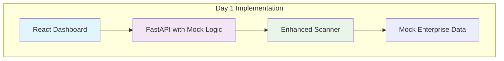

# 2-Day Prototype Sprint Plan

## Goal
Create a working prototype with a beautiful dashboard showing system connections and full explainability within 2 days.

## Priority Focus Areas
1. **Beautiful Interactive Dashboard** - Visual connections between system parts
2. **Explainability** - Show how system reaches conclusions
3. **Knowledge Gaps** - Clearly identify missing information
4. **Working Demo** - End-to-end flow with mock data

## Day 1: Core Functionality (8 hours)

### Morning (4 hours): Backend Foundation
- ✅ **Keep Current Architecture** - No major refactoring
- ✅ **Enhance Scanner** - Add simple dependency detection
- ✅ **Mock LLM** - Simple rule-based responses for demo
- ✅ **API Updates** - Return structured graph data

### Afternoon (4 hours): Basic Frontend
- ✅ **React Flow Integration** - Interactive graph visualization
- ✅ **Basic UI Components** - Header, search bar, graph area
- ✅ **Mock Data Integration** - Connect to API endpoints

## Day 2: Polish & Explainability (8 hours)

### Morning (4 hours): Advanced Features
- ✅ **Explainability Panel** - Show evidence for connections
- ✅ **Knowledge Gaps Banner** - Highlight missing information
- ✅ **Investigation Sidebar** - Details for clicked nodes

### Afternoon (4 hours): Polish & Demo Prep
- ✅ **Visual Enhancements** - Animations, styling
- ✅ **Error Handling** - Graceful failures
- ✅ **Demo Script** - Prepare presentation

## Simplified Architecture for Prototype



## Implementation Details

### Day 1 Tasks

#### 1. Enhanced Scanner (Morning)
```python
# scanner/app/main.py - Add dependency detection
class DependencyResult(BaseModel):
    source_file: str
    target_file: str
    relationship: str  # "reads_from", "writes_to", "imports"
    evidence: str
    confidence: float

@app.post("/analyze-dependencies")
async def analyze_dependencies(paths: List[str]):
    """Simple rule-based dependency analysis"""
    results = []
    
    # Rule 1: SQL schema -> Python models
    sql_files = find_files(paths, "*.sql")
    python_files = find_files(paths, "*.py")
    
    for sql in sql_files:
        for py in python_files:
            if references_table(sql, py):
                results.append(DependencyResult(
                    source_file=sql,
                    target_file=py,
                    relationship="defines_structure_for",
                    evidence=f"Table in {sql} referenced in {py}",
                    confidence=0.9
                ))
    
    return results
```

#### 2. Mock LLM Logic (Morning)
```python
# api/app/mock_llm.py
class MockLLMService:
    async def investigate_change(self, query: str):
        """Simple rule-based investigation for demo"""
        
        # Extract key terms from query
        if "term_sheet_id" in query:
            return await self.investigate_term_sheet_id()
        
        # Default response
        return self.generate_dummy_response(query)
    
    async def investigate_term_sheet_id(self):
        """Pre-canned response for term_sheet_id changes"""
        
        # Call scanner for literal matches
        literal_results = await self.scanner_client.post("/scan", {
            "query": "term_sheet_id",
            "paths": ["/app/mock_enterprise"]
        })
        
        # Call scanner for dependencies
        dependency_results = await self.scanner_client.post("/analyze-dependencies", {
            "paths": ["/app/mock_enterprise"]
        })
        
        # Build impact graph
        return self.build_graph(literal_results, dependency_results)
```

#### 3. API Updates (Morning)
```python
# api/app/main.py - Enhanced /investigate endpoint
@app.post("/investigate")
async def investigate_change(request: InvestigationRequest):
    """Enhanced investigation with dependency analysis"""
    
    # Use mock LLM for prototype
    llm_service = MockLLMService()
    result = await llm_service.investigate_change(request.query)
    
    return ImpactReport(
        query=request.query,
        nodes=result["nodes"],
        edges=result["edges"],
        knowledge_gaps=result["knowledge_gaps"],
        explanation=result["explanation"],  # New field for explainability
        confidence_score=result["confidence_score"]  # New field
    )
```

#### 4. Frontend Foundation (Afternoon)
```typescript
// ui/src/components/DependencyGraph.tsx
import React, { useCallback, useMemo } from 'react';
import ReactFlow, {
  Node,
  Edge,
  addEdge,
  ConnectionLineType,
  Panel,
  useNodesState,
  useEdgesState,
} from 'reactflow';

import 'reactflow/dist/style.css';

const nodeTypes = {
  database: DatabaseNode,
  service: ServiceNode,
  file: FileNode,
};

export const DependencyGraph: React.FC = () => {
  const [nodes, setNodes, onNodesChange] = useNodesState([]);
  const [edges, setEdges, onEdgesChange] = useEdgesState([]);
  const [selectedNode, setSelectedNode] = useState<Node | null>(null);

  const onConnect = useCallback(
    (params: Connection) => setEdges((eds) => addEdge(params, eds)),
    [setEdges]
  );

  // Load data from API
  useEffect(() => {
    const loadData = async () => {
      const response = await fetch('/investigate', {
        method: 'POST',
        headers: { 'Content-Type': 'application/json' },
        body: JSON.stringify({ query: 'Change term_sheet_id from string to UUID' })
      });
      const data = await response.json();
      
      setNodes(data.nodes);
      setEdges(data.edges);
    };
    
    loadData();
  }, []);

  return (
    <div style={{ width: '100vw', height: '100vh' }}>
      <ReactFlow
        nodes={nodes}
        edges={edges}
        onNodesChange={onNodesChange}
        onEdgesChange={onEdgesChange}
        onConnect={onConnect}
        nodeTypes={nodeTypes}
        connectionLineType={ConnectionLineType.SmoothStep}
        fitView
      >
        <Panel position="top-left">
          <SearchBar onSearch={handleSearch} />
        </Panel>
        
        <Panel position="top-right">
          <KnowledgeGapsBanner gaps={knowledgeGaps} />
        </Panel>
        
        <Panel position="bottom-left">
          <ExplanationPanel explanation={explanation} />
        </Panel>
      </ReactFlow>
    </div>
  );
};
```

### Day 2 Tasks

#### 1. Explainability Panel (Morning)
```typescript
// ui/src/components/ExplanationPanel.tsx
interface ExplanationPanelProps {
  explanation: {
    reasoning_steps: string[];
    evidence_sources: Array<{
      file: string;
      line: number;
      content: string;
      confidence: number;
    }>;
    confidence_score: number;
  };
}

export const ExplanationPanel: React.FC<ExplanationPanelProps> = ({ explanation }) => {
  return (
    <Card className="explanation-panel">
      <h3>How We Reached This Conclusion</h3>
      
      <div className="confidence-score">
        <strong>Overall Confidence:</strong> 
        <ProgressBar value={explanation.confidence_score * 100} />
      </div>
      
      <div className="reasoning-steps">
        <h4>Reasoning Steps:</h4>
        <ol>
          {explanation.reasoning_steps.map((step, index) => (
            <li key={index}>{step}</li>
          ))}
        </ol>
      </div>
      
      <div className="evidence-sources">
        <h4>Evidence Sources:</h4>
        {explanation.evidence_sources.map((source, index) => (
          <EvidenceCard key={index} source={source} />
        ))}
      </div>
    </Card>
  );
};
```

#### 2. Knowledge Gaps Banner (Morning)
```typescript
// ui/src/components/KnowledgeGapsBanner.tsx
interface KnowledgeGapsBannerProps {
  gaps: Array<{
    component: string;
    missing_information: string;
    required_action: string;
    estimated_impact: string;
  }>;
}

export const KnowledgeGapsBanner: React.FC<KnowledgeGapsBannerProps> = ({ gaps }) => {
  if (gaps.length === 0) return null;
  
  return (
    <Alert severity="warning" className="knowledge-gaps-banner">
      <AlertTitle>⚠️ Knowledge Gaps Identified</AlertTitle>
      <div className="gaps-list">
        {gaps.map((gap, index) => (
          <div key={index} className="gap-item">
            <strong>{gap.component}:</strong> {gap.missing_information}
            <div className="required-action">
              <strong>Action:</strong> {gap.required_action}
            </div>
            <div className="estimated-impact">
              <strong>Impact:</strong> {gap.estimated_impact}
            </div>
          </div>
        ))}
      </div>
    </Alert>
  );
};
```

#### 3. Investigation Sidebar (Morning)
```typescript
// ui/src/components/InvestigationSidebar.tsx
export const InvestigationSidebar: React.FC = () => {
  const [selectedNode, setSelectedNode] = useState<Node | null>(null);
  const [nodeDetails, setNodeDetails] = useState<any>(null);
  
  useEffect(() => {
    if (selectedNode) {
      // Fetch detailed information about selected node
      fetch(`/node-details/${selectedNode.id}`)
        .then(res => res.json())
        .then(setNodeDetails);
    }
  }, [selectedNode]);
  
  return (
    <Drawer
      anchor="right"
      open={!!selectedNode}
      onClose={() => setSelectedNode(null)}
    >
      {nodeDetails && (
        <div className="node-details">
          <h3>{nodeDetails.name}</h3>
          
          <div className="node-info">
            <p><strong>Type:</strong> {nodeDetails.type}</p>
            <p><strong>Path:</strong> {nodeDetails.path}</p>
            <p><strong>Source:</strong> {nodeDetails.source_type}</p>
            <p><strong>Last Updated:</strong> {nodeDetails.last_updated}</p>
          </div>
          
          <div className="code-snippet">
            <h4>Relevant Code:</h4>
            <SyntaxHighlighter language={getLanguage(nodeDetails.path)}>
              {nodeDetails.relevant_code}
            </SyntaxHighlighter>
          </div>
          
          <div className="connections">
            <h4>Connections:</h4>
            <List>
              {nodeDetails.connections.map((conn, index) => (
                <ListItem key={index}>
                  <ListItemIcon>
                    {getConnectionIcon(conn.type)}
                  </ListItemIcon>
                  <ListItemText
                    primary={conn.target}
                    secondary={conn.relationship}
                  />
                </ListItem>
              ))}
            </List>
          </div>
        </div>
      )}
    </Drawer>
  );
};
```

## Demo Script for Day 2

### Scenario: "Change term_sheet_id from string to UUID"

1. **Start Demo**
   - Open dashboard at localhost:3000
   - Show clean interface with search bar

2. **Enter Query**
   - Type: "Change term_sheet_id from string to UUID"
   - Click "Investigate"

3. **Show Results**
   - Graph appears with 4 main components
   - Highlight connections between components
   - Show confidence scores on edges

4. **Explainability**
   - Click "How We Reached This Conclusion" panel
   - Show reasoning steps
   - Show evidence sources with line numbers

5. **Knowledge Gaps**
   - Point out yellow warning banner
   - Explain missing external API documentation
   - Show required actions

6. **Interactive Exploration**
   - Click on schema.sql node
   - Show sidebar with code snippet
   - Show connections to other components

7. **Conclusion**
   - Summarize findings
   - Emphasize explainability and knowledge gaps
   - Discuss next steps for real implementation

## Success Criteria for Prototype

### Must-Have (Day 2)
- ✅ Beautiful interactive dashboard with React Flow
- ✅ Working end-to-end investigation flow
- ✅ Clear explainability panel with reasoning
- ✅ Knowledge gaps identification and display
- ✅ Interactive node exploration with code snippets

### Nice-to-Have (If Time)
- ✅ Animated graph layout
- ✅ Confidence score visualization
- ✅ Export investigation results
- ✅ Search history

## Risk Mitigation

### Technical Risks
- **React Flow Complexity**: Use simple examples, focus on core functionality
- **API Integration**: Mock responses first, integrate real API later
- **Performance**: Limit to mock data size, optimize later

### Timeline Risks
- **Scope Creep**: Strict focus on core features
- **Technical Blockers**: Have fallback solutions ready
- **Integration Issues**: Test components independently first

This 2-day sprint focuses on delivering a visually impressive and functional prototype that demonstrates the core value proposition of the Enterprise Code Archaeologist system.