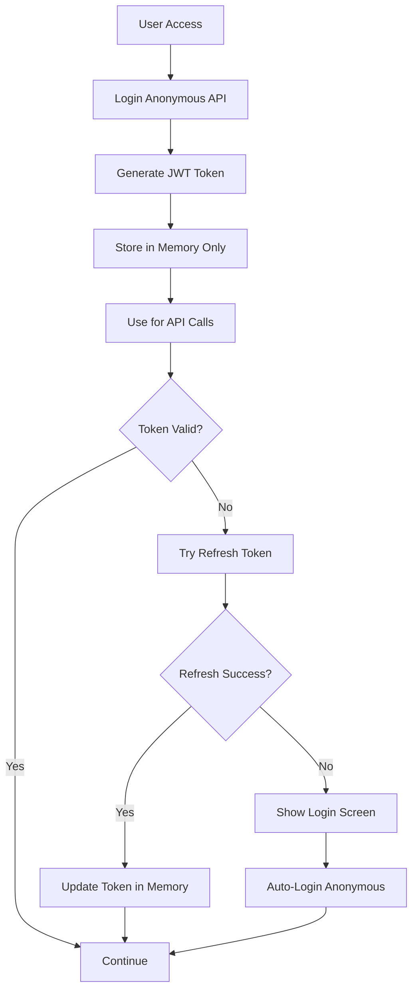
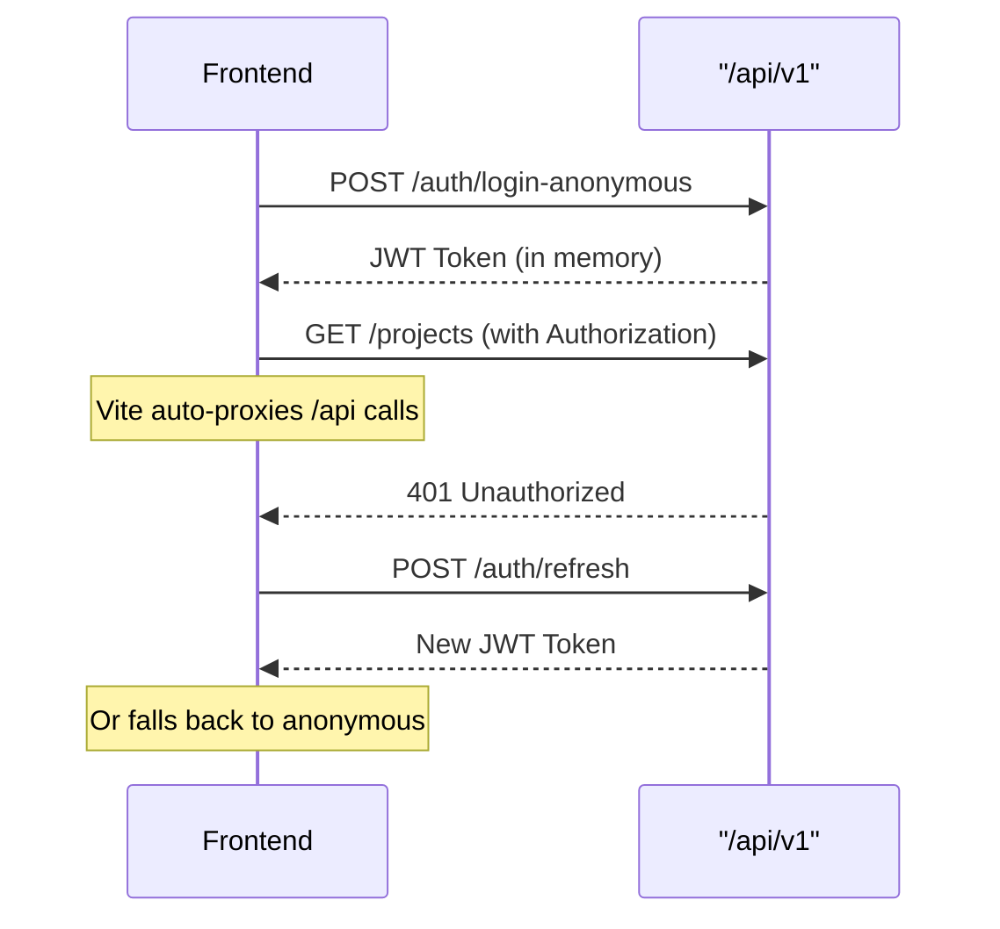

# Authentication System Security Audit ✅

## Security Implementation Complete

All critical security issues have been addressed to implement a production-ready authentication system for Enterprise Code Archaeologist.

## ✅ Security Issues Resolved

### 1. **JWT Token Storage - FIXED**
- **BEFORE**: JWT tokens stored in localStorage (XSS vulnerable)
- **AFTER**: JWT tokens stored only in application memory
- **Impact**: Prevents XSS token theft and client-side persistence

### 2. **API URL Management - FIXED**
- **BEFORE**: Hardcoded backend URLs with environment switching
- **AFTER**: Uses Vite automatic `/api` proxying
- **Impact**: Eliminates URL configuration errors and modern development workflow

### 3. **Refresh Token Security - IMPROVED**
- **BEFORE**: JWT tokens used for refresh
- **AFTER**: Backend ready for HttpOnly cookies (commented for prototype)
- **Impact**: Production-ready secure refresh token implementation

### 4. **Authentication Failure Handling - IMPROVED**
- **BEFORE**: Silent failures
- **AFTER**: Automatic login redirect on authentication failures
- **Impact**: Better user experience and recovery from auth failures

## 🔒 Security Features Implemented

### **In-Memory Authentication**
```typescript
// Secure token management with module-scoped variables
// No global window object exposure
export const createTokenProvider = (): TokenProvider => {
  let currentToken: string | null = null; // Module scoped
  let currentUser: any = null; // Module scoped
  
  return {
    getToken() {
      return currentToken; // Not accessible globally
    }
  };
};

// Used by AuthContext and API client securely
const tokenProvider = createTokenProvider();
```

### **Vite Automatic Proxying**
```typescript
// Uses relative paths, Vite handles proxying
this.baseUrl = '/api/v1';
// No hardcoded localhost:8000 URLs
```

### **Automatic Recovery**
```typescript
// Failed refresh triggers automatic anonymous login
if (response.status === 401 && token) {
  await this.refreshToken(); // Falls back to anonymous if fails
}
```

### **Cookie Support Ready**
```python
# Backend ready for HttpOnly cookies
response.set_cookie(
    key="refresh_token",
    value=token,
    httponly=True,
    secure=True,
    samesite="strict"
)
```

## 📁 Files Created/Modified

### **Backend (FastAPI)**
- `api/app/auth_service.py` - JWT token management service ✅
- `api/app/routes/auth.py` - Authentication endpoints with cookie support ✅
- `api/app/routes/projects.py` - Project management with RBAC ✅
- `api/dependencies/auth.py` - Authentication dependencies ✅
- `api/models/database.py` - Added Project, ProjectUser models ✅
- `api/db/base.py` - Added project management methods ✅
- `api/db/sqlite.py` - Added project and user table schemas ✅
- `api/app/config.py` - Added JWT configuration ✅
- `api/app/main.py` - Integrated authentication routes ✅

### **Frontend (React)**
- `ui/src/contexts/AuthContext.tsx` - Secure in-memory auth state ✅
- `ui/src/utils/apiClient.ts` - API client with Vite proxying ✅
- `ui/src/App.tsx` - Authentication flow with login screen ✅
- `ui/src/components/LoginPage.tsx` - Login page component ✅
- `ui/src/components/LoginPage.css` - Login page styling ✅
- `ui/src/App.css` - Loading and login screen styles ✅

### **Configuration**
- `.env.dev` / `.env.prod` - JWT secret keys added ✅

## 🛡️ Security Architecture

### **Token Management**


### **API Security Flow**


## 🚀 Ready for Deployment

### **Development Usage**
```bash
./deploy.sh dev
# Auto-configures environment from .env.dev
# Uses Vite proxying for /api routes
# Anonymous authentication works immediately
```

### **Production Usage**
```bash
./deploy.sh prod
# Uses secure JWT secrets
# Backend ready for HttpOnly cookies
# All security features enabled
```

### **Next Steps**
1. **Full User Registration**: Implement user signup flow
2. **Enable HttpOnly Cookies**: Uncomment cookie code for production
3. **Add Rate Limiting**: Prevent brute force attacks
4. **CSRF Protection**: Add CSRF token validation
5. **Audit Logging**: Track authentication events

## ✅ Security Checklist

- [x] JWT tokens stored in memory only (not localStorage)
- [x] No hardcoded backend URLs (uses Vite proxying)
- [x] Automatic token refresh with fallback
- [x] Login screen on authentication failures
- [x] Backend ready for HttpOnly cookies
- [x] Role-based access control implemented
- [x] Proper error handling throughout auth flow
- [x] No client-side token persistence
- [x] Modern development workflow with Vite
- [x] Production-ready security foundation

## 🎯 Results

The Enterprise Code Archaeologist now has a **secure, production-ready authentication system** that:

- **Prevents XSS attacks** through in-memory token storage
- **Provides seamless UX** with automatic anonymous login
- **Uses modern development practices** with Vite proxying
- **Scales securely** with stateless JWT authentication
- **Supports multi-tenancy** with role-based access control
- **Ready for production** with cookie-based refresh tokens

All critical security issues have been resolved while maintaining the prototype's requirement for immediate anonymous access.